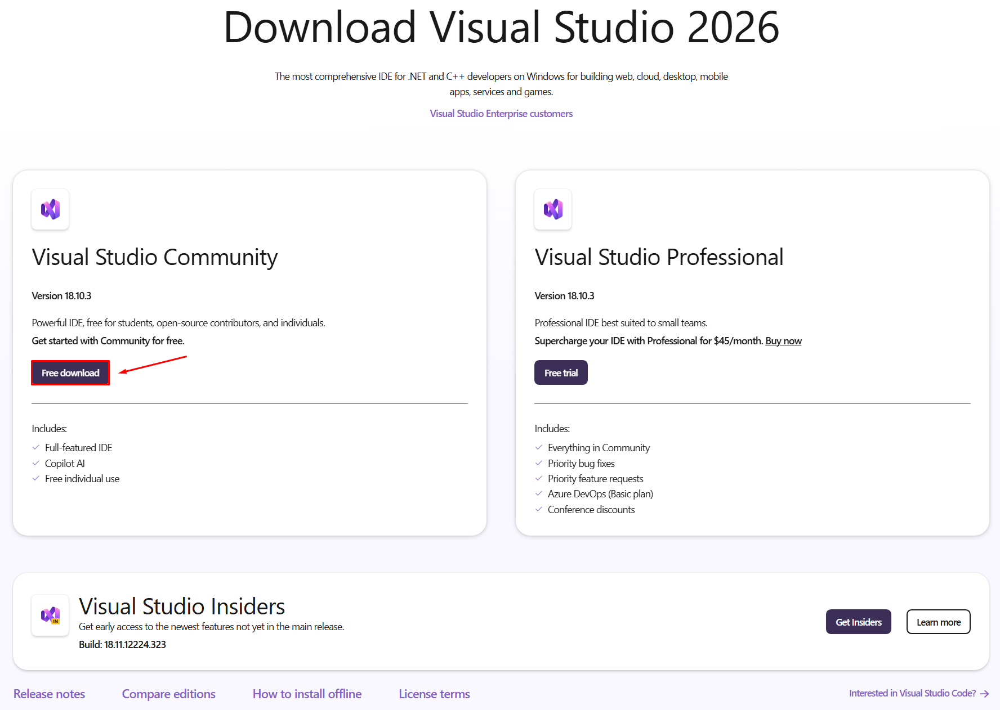
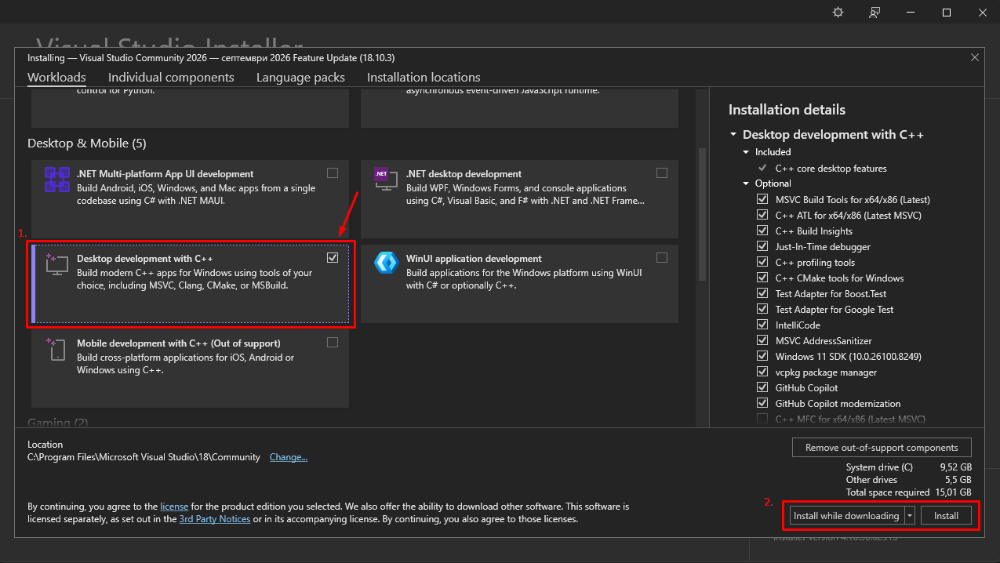
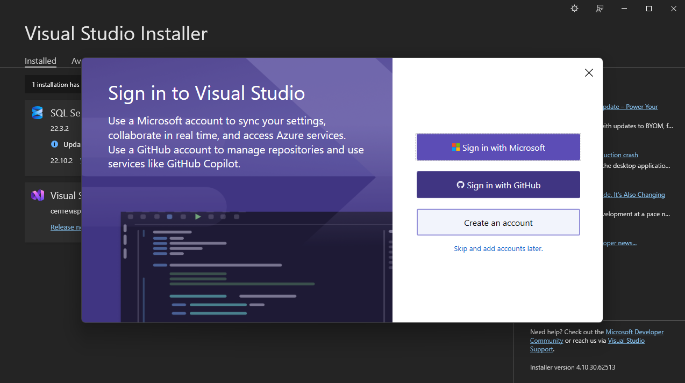
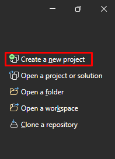
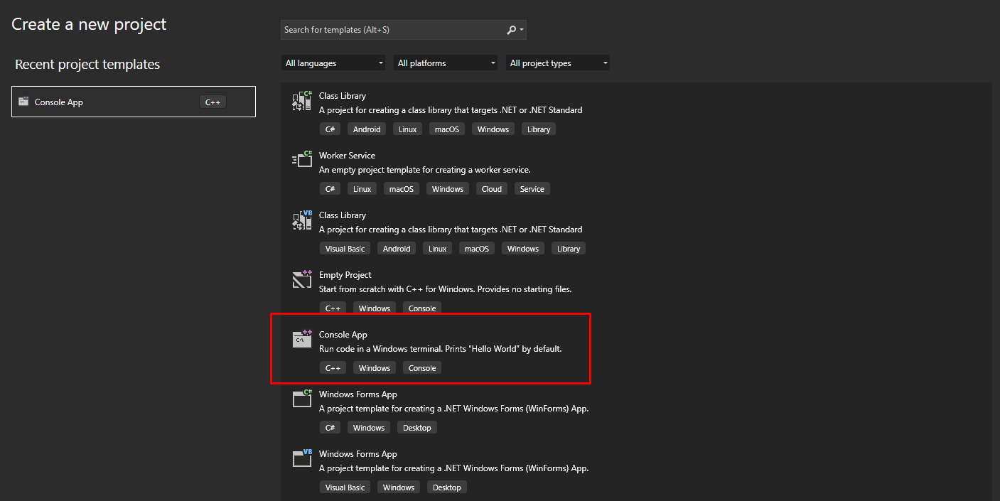
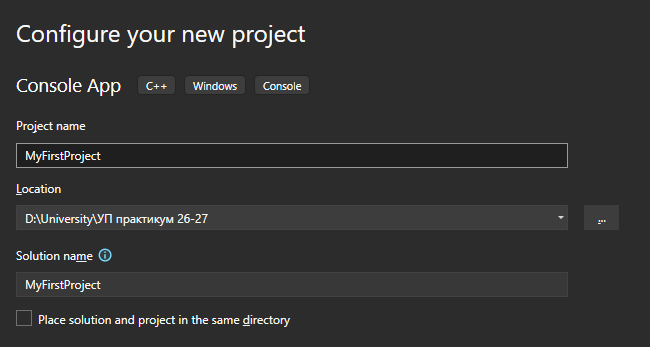
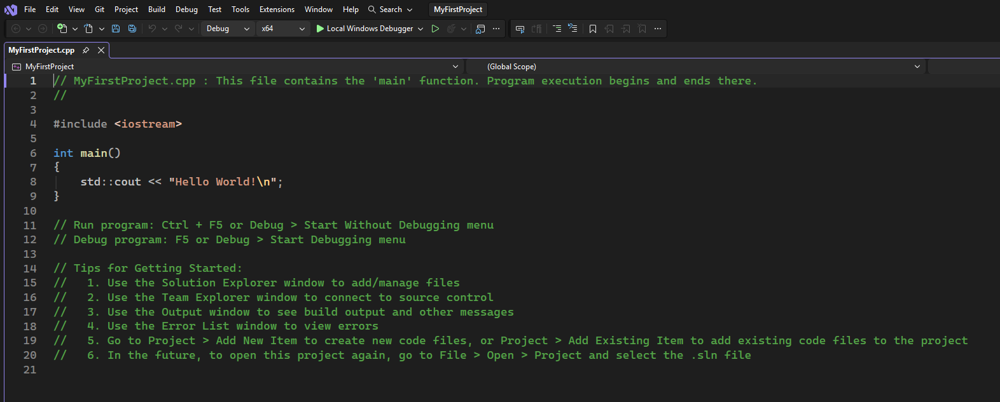

# Инсталиране на Visual Studio Community 2026

Инструкциите са за Windows. Инсталацията заема около 15 GB място на диска, така че се уверете, че имате достатъчно свободно пространство.

1. Насочете се към страницата [Download Visual Studio](https://visualstudio.microsoft.com/downloads/).

2. Изтеглете версията **Visual Studio Community**.

   

3. Запазете Visual Studio Installer в папка по ваш избор и го стартирайте.

4. Изберете **Desktop development with C++** и натиснете **Install** в долния десен ъгъл.

   

5. След успешна инсталация изберете една от опциите за акаунт. Ако нямате акаунт и не искате да създавате, можете да изберете **Skip and add accounts later**.

   

6. Вероятно ще ви се покаже прозорецът по-долу. На този етап препоръчваме да изберете **Maybe later**, тъй като AI асистентът може да навреди повече, отколкото да помогне, докато се учите.

   

7. Вече сте готови да създадете първия си проект! В горния десен ъгъл на прозореца трябва да имате бутона **Create a new project** – натиснете го.

   

8. От списъка с шаблони изберете **Console App** с етикет C++ и натиснете **Next** в долния десен ъгъл. Ако не откривате **Console App**, използвайте търсачката отгоре.

   

9. Въведете име на проекта в полето **Project name**, изберете в коя папка да бъде запазен от полето **Location** и натиснете **Create**. Името на проекта трябва да е на английски (не на шльокавица), без интервали и да подсказва за какво служи проектът, например `SumOfTwoNumbers` вместо `Proekt1` или `Test`.

   

10. Visual Studio автоматично създава файл с примерна програма, която отпечатва "Hello World!". За да я стартирате, натиснете **Ctrl + F5** или зеления бутон **Local Windows Debugger** в горната лента. Ако на екрана се появи конзола с надпис "Hello World!", всичко е инсталирано успешно. След това можете да изтриете коментарите (редовете, започващи с `//`), тъй като те са само пояснения и не влияят на програмата. Собствения си код засега пишете между фигурните скоби `{ }` на `main`, на мястото на реда с `std::cout`.

    